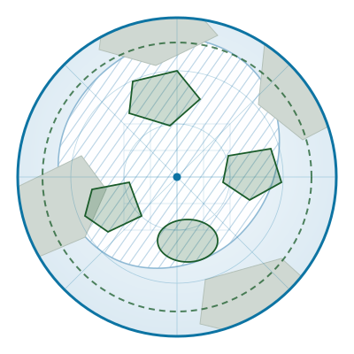

::: {.hero}
::: {.hero-inner}
::: {.hero-text}
[PAME / CAFF joint project · 2025–2027]{.tagline}

# ACTAME

::: {.hero-expansion}
Arctic Conservation Tool for Area-based Measures and Ecosystems
:::

A pan-Arctic planning tool for area-based conservation — bringing the spatial
evidence, the existing measures and the conservation objectives into one place,
so that decisions about where to protect what can be made on a common,
documented basis. The first case study is on sea-ice-dependent species.

[Explore the tools](tools.qmd){.btn .btn-primary role="button"}
[About the project](about.qmd){.btn .btn-outline-secondary role="button"}
:::

::: {.hero-art}

:::
:::
:::

## The challenge

The Arctic marine environment is changing faster than the measures meant to
protect it. Sea ice — the structuring habitat for much of the region's
biodiversity — is retreating, and the species that depend on it are moving with
it. At the same time, states are committed under the Kunming-Montreal Global
Biodiversity Framework to effectively conserve and manage 30% of coastal and
marine areas through protected areas and other effective area-based
conservation measures (OECMs).

Meeting that commitment in the Arctic means answering a spatial question:
where do area-based measures deliver most, given what we know about ecology,
what is already in place, and how the system is projected to change? The
evidence needed to answer it is spread across institutions, projects and
formats. ACTAME is being built to bring it together.

## What ACTAME does

::: {.card-row}
::: {.a-card}
### Atlas
An interactive compendium of the spatial layers behind the tool. Every layer is
documented with why it matters for the conservation objectives, its resolution,
coverage and period, the analysis behind it, and the maps themselves.
:::

::: {.a-card}
### Map
An interactive circumpolar map on Arctic SDI and NPI basemaps, with existing
area-based measures and ecological boundaries as toggleable layers — LMEs, the
CAFF boundary, EEZs, EBSAs and MPAs.
:::

::: {.a-card}
### Metadata
The same layer documentation as a searchable, sortable and downloadable table,
so the underlying data can be traced, cited and reused.
:::
:::

## How the project runs

::: {.card-row}
::: {.a-card .green}
[Phase 1]{.step}

### Horizon scan and scoping
Identifying the conservation objectives and the spatial layers needed to
support them.
:::

::: {.a-card .green}
[Phase 2]{.step}

### Data portal and atlas
Assembling, documenting and publishing the layers. The ACTAME dashboard is
where that work becomes visible.
:::

::: {.a-card .green}
[Phase 3]{.step}

### Spatial planning application
Using the assembled layers for prioritisation and scenario analysis across the
pan-Arctic domain.
:::
:::

::: {.status-note}
**Status — early build.** The Map component runs on real data. The Atlas and
Metadata components currently carry a placeholder skeleton so that the
structure can be reviewed before the project's own layers and figures are
available. Follow progress on the [Tools](tools.qmd) page.
:::

## Who is behind it

ACTAME is developed under the [PAME](https://pame.is/) Marine Protected Areas
Expert Group (MPA-EG) as a joint project with [CAFF](https://caff.is/), the two
Arctic Council working groups responsible for the protection of the Arctic
marine environment and for Arctic biodiversity. The work is led by the
[Norwegian Polar Institute](https://www.npolar.no/) and builds on the approach
taken by the CCAMLR Weddell Sea MPA Phase 2 planning tool.

[Team and partners](team.qmd){.btn .btn-outline-secondary role="button"}
[Get in touch](contact.qmd){.btn .btn-outline-secondary role="button"}
